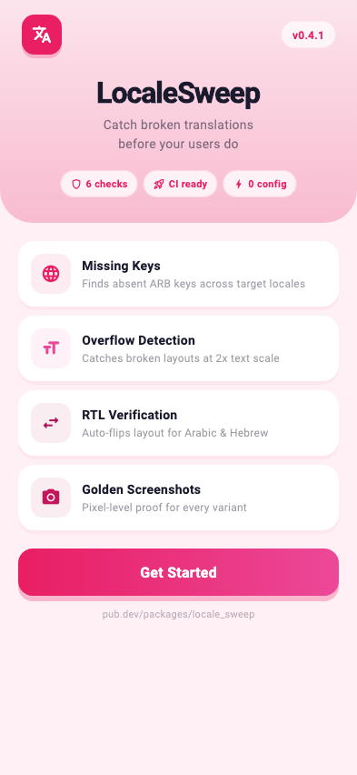
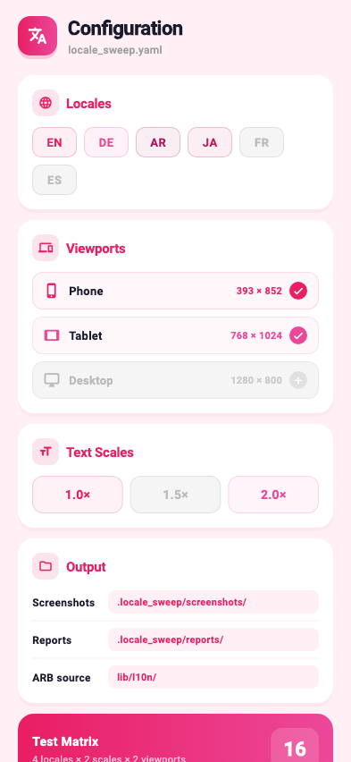
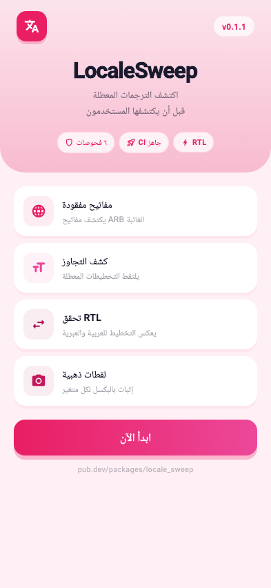
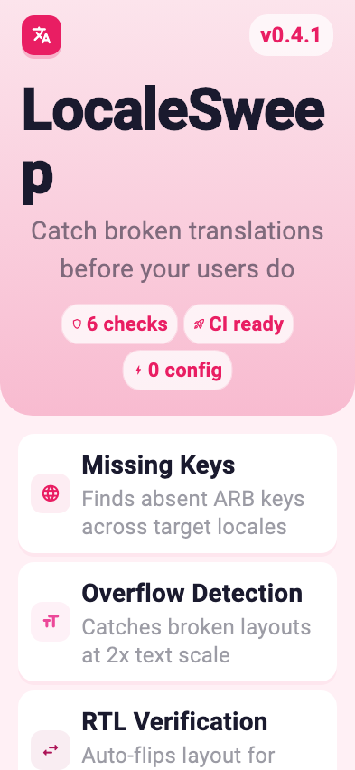
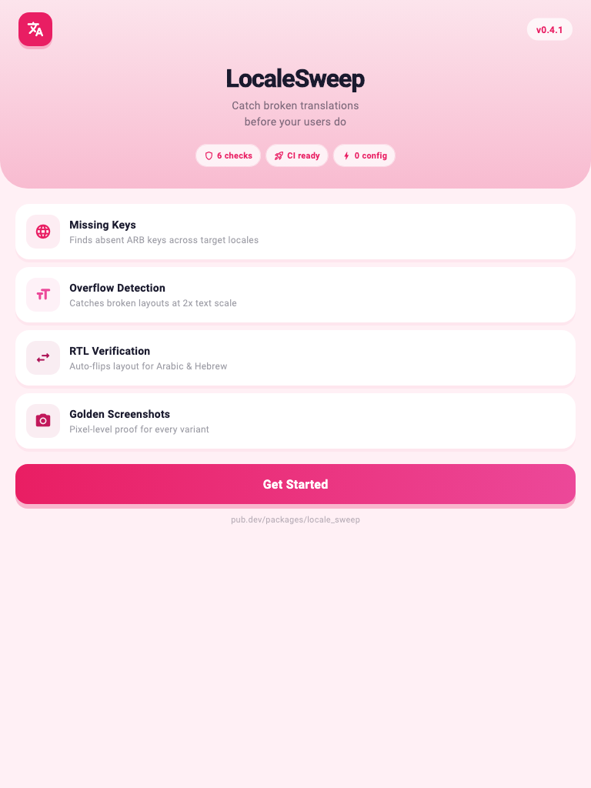
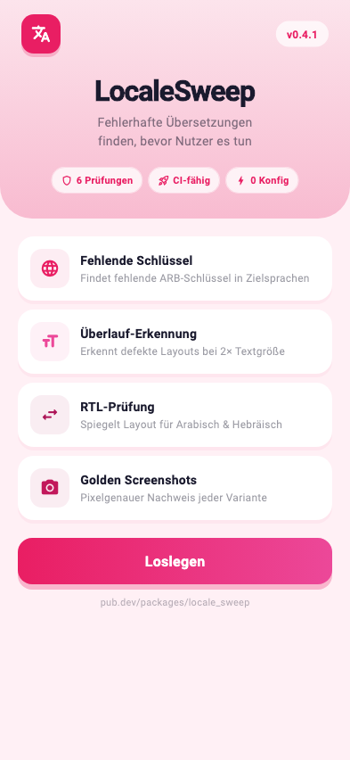
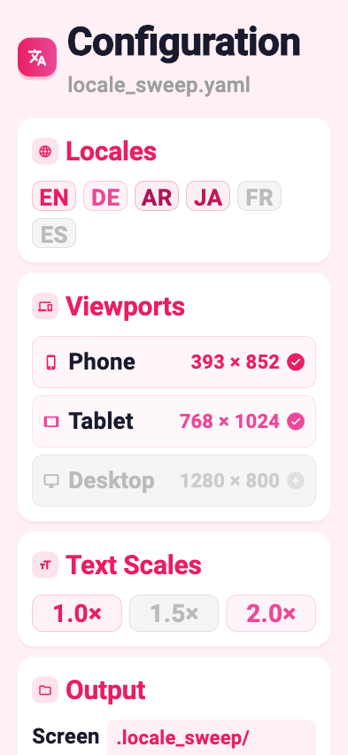
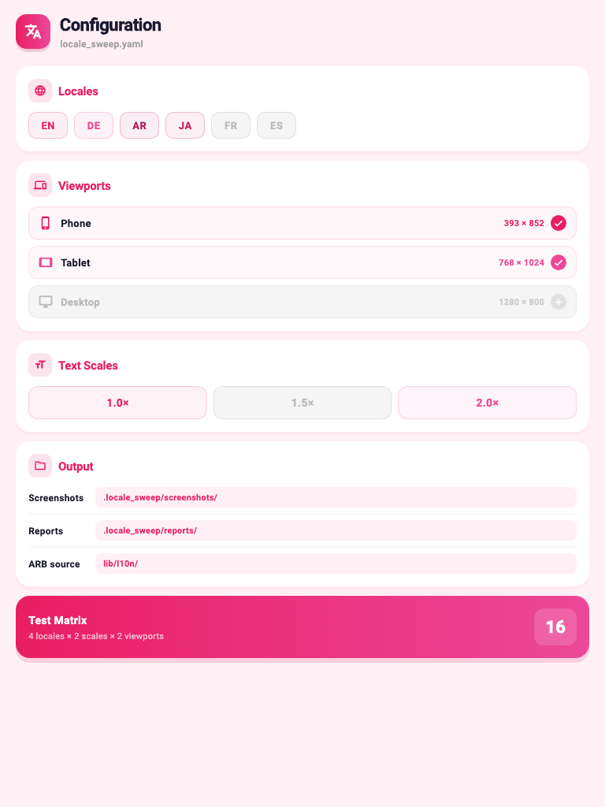

<p align="center">
  
  &nbsp;&nbsp;
  
  &nbsp;&nbsp;
  
  &nbsp;&nbsp;
  
</p>

<h1 align="center">LocaleSweep</h1>

<p align="center">
  <strong>Localization release QA for Flutter</strong><br/>
  <sub>Run every screen across every locale, viewport, and text scale — catch what slips through code review.</sub>
</p>

<p align="center">
  <a href="https://pub.dev/packages/locale_sweep"></a>
  &nbsp;
  <a href="https://pub.dev/packages/locale_sweep/score"></a>
  &nbsp;
  <a href="https://opensource.org/licenses/MIT"></a>
  &nbsp;
  <a href="https://flutter.dev"></a>
</p>

<br/>

> **The problem:** Your app looks perfect in English. Then a German user opens Settings and *"Benachrichtigungseinstellungen"* overflows the row. An Arabic user sees left-aligned text. A Japanese user hits a screen with an untranslated key. You find out from a 1-star review.

<br/>

## The fix

One function call. LocaleSweep multiplies your test across **locales × text scales × viewports**, captures a golden screenshot of every variant, and fails only the ones that break — with visual proof attached.

```dart
sweepTest(
  'settings',
  builder: () => const MyApp(),
  arbDir: 'lib/l10n',
  locales: ['en', 'de', 'ar', 'ja'],
  textScales: [1.0, 2.0],
  viewports: [ViewportPreset.phone, ViewportPreset.tablet],
);
```

> That single call generates **16 test cases**. Each one renders your widget, checks for overflow, validates ARB translations, and saves a screenshot.

<br/>

## What it catches

| | Category | How it works |
|:--|:--|:--|
| **01** | **Text overflow** | Intercepts `RenderFlex` overflow errors — catches German compound words, Arabic expansion, CJK wrapping |
| **02** | **Missing ARB keys** | Static analysis of ARB files — finds keys in `app_en.arb` absent in target locales |
| **03** | **Placeholder mismatches** | Verifies `{count}`, `{name}`, etc. from base locale metadata appear in every translation |
| **04** | **Golden regression** | Pixel-level comparison against committed baselines — catches unintended visual changes |
| **05** | **Accessibility scaling** | Renders at 2x text scale to catch layouts that break for large text users |
| **06** | **RTL layout** | Auto-detects Arabic, Hebrew, Farsi and renders right-to-left |

<br/>

## Quick start

**1. Install**

```yaml
dev_dependencies:
  locale_sweep: ^0.1.1
```

**2. Write a sweep test**

```dart
// test/sweep/onboarding_test.dart
import 'package:flutter/material.dart';
import 'package:flutter_test/flutter_test.dart';
import 'package:locale_sweep/locale_sweep.dart';

void main() {
  sweepTest(
    'onboarding',
    builder: () => const MyApp(),
    arbDir: 'lib/l10n',
    body: (tester) async {
      expect(find.text('Welcome'), findsOneWidget);
      await tester.tap(find.byType(ElevatedButton));
      await tester.pumpAndSettle();
    },
  );
}
```

**3. Generate baselines, then guard them in CI**

```bash
dart run locale_sweep update        # Generate golden screenshots locally
dart run locale_sweep run           # Compare against baselines (CI)
```

<br/>

## Screenshots

Every variant gets its own golden PNG — locale, text scale, and viewport encoded in the filename:

<table>
  <tr>
    <th align="center">English · Phone</th>
    <th align="center">Arabic · RTL</th>
    <th align="center">English · 2x Scale</th>
    <th align="center">English · Tablet</th>
  </tr>
  <tr>
    <td></td>
    <td></td>
    <td></td>
    <td></td>
  </tr>
  <tr>
    <td></td>
    <td></td>
    <td></td>
    <td></td>
  </tr>
</table>

<sub>Real golden files rendered with Roboto & Material Icons in headless Flutter widget tests — not mockups.</sub>

<br/>

## CLI

```bash
dart run locale_sweep run                         # Compare goldens, fail broken variants
dart run locale_sweep run --flows onboarding      # Run specific flows only
dart run locale_sweep run --github-pr             # Post results as a PR comment
dart run locale_sweep update                      # Regenerate golden baselines
dart run locale_sweep update --flows settings     # Update specific flows only
```

> `run` **never** passes `--update-goldens`. Only `update` regenerates baselines. This prevents CI from silently accepting a broken layout as the new normal.

<br/>

## GitHub Actions

```yaml
- name: LocaleSweep
  run: dart run locale_sweep run --github-pr
  env:
    GITHUB_TOKEN: ${{ secrets.GITHUB_TOKEN }}
```

Posts a PR comment with a failure table, locale summary, and screenshot links. Updates the same comment on re-runs — no spam.

<br/>

## Configuration

Create `locale_sweep.yaml` in your project root:

```yaml
locales: [en, de, ar, ja]
text_scales: [1.0, 2.0]

viewports:
  - { name: "375x667", width: 375, height: 667 }
  - { name: "768x1024", width: 768, height: 1024 }

arb_dir: lib/l10n
screenshot_dir: .locale_sweep/screenshots
report_dir: .locale_sweep/reports
```

Or override per-flow directly in `sweepTest()`:

```dart
sweepTest(
  'checkout',
  builder: () => const CheckoutPage(),
  locales: ['en', 'de'],
  textScales: [1.0, 1.5, 2.0],
  viewports: [ViewportPreset.phoneSmall],
  arbDir: 'lib/l10n',
  captureScreenshots: true,
);
```

<br/>

## API reference

<details>
<summary><strong><code>sweepTest()</code></strong> — expand to see all parameters</summary>
<br/>

| Parameter | Type | Default | Description |
|:--|:--|:--|:--|
| `flowName` | `String` | required | Name for this flow — used in labels and file paths |
| `builder` | `Widget Function()` | required | Widget to render |
| `body` | `Future<void> Function(WidgetTester)` | `null` | Interactions to run after pump |
| `locales` | `List<String>` | config | BCP-47 locale codes |
| `textScales` | `List<double>` | config | Text scale factors |
| `viewports` | `List<ViewportPreset>` | config | Viewport dimensions |
| `arbDir` | `String?` | config | Path to ARB files for static analysis |
| `captureScreenshots` | `bool` | `true` | Save a golden per variant |

</details>

<details>
<summary><strong><code>ViewportPreset</code></strong> — built-in presets</summary>
<br/>

| Preset | Dimensions | Use case |
|:--|:--|:--|
| `ViewportPreset.phoneSmall` | 375 × 667 | Compact phones |
| `ViewportPreset.phone` | 393 × 852 | Standard phones |
| `ViewportPreset.phoneWide` | 412 × 915 | Tall phones |
| `ViewportPreset.tablet` | 768 × 1024 | Tablets |

Custom: `ViewportPreset(name: '1280x800', width: 1280, height: 800)`

</details>

<br/>

## Real-world validation

Tested against two popular open-source Flutter apps to verify signal quality:

| App | Stars | Result |
|:--|:--|:--|
| **[Spotube](https://github.com/KRTirtho/spotube)** | 48k+ | 0 issues across de/ar/ja/fr/es/ko/zh — **zero false positives** |
| **[wger](https://github.com/wger-project/flutter)** | 960+ | **165 missing Arabic keys**, **1 placeholder mismatch**, **301 missing Hebrew keys** — all real bugs |

> LocaleSweep found real translation gaps in wger while producing zero noise on Spotube's complete translations.

<br/>

## Output

```
.locale_sweep/
  report.md                              # Markdown failure table + locale summary
  report.json                            # Machine-readable results
  screenshots/
    onboarding_en_393x852.png
    onboarding_de_2.0x_393x852.png
    onboarding_ar_768x1024.png
    settings_en_375x667.png
    ...
```

<br/>

## How it works

| Step | What happens |
|:--|:--|
| **1** | `sweepTest()` expands into `locales × scales × viewports` individual `testWidgets` calls |
| **2** | Each test configures the Flutter test view with the target viewport, locale, and text scale |
| **3** | Your widget is pumped inside `Directionality` + `MediaQuery` wrappers |
| **4** | `OverflowDetector` hooks into `FlutterError.onError` to capture `RenderFlex` overflow |
| **5** | `matchesGoldenFile` saves or compares the screenshot |
| **6** | `ArbAnalyzer` runs once per group — static analysis of ARB JSON, no rendering needed |
| **7** | Results are recorded **before** `fail()` — screenshots always exist even for broken variants |

<br/>

## Design decisions

**Flows are developer-defined.** `sweepTest()` does not auto-discover routes. You define the widget and the interactions. This keeps tests deterministic and fast.

**Viewport presets are layout simulations.** They set the test view's `physicalSize` and `devicePixelRatio`. This gives accurate Flutter layout at those dimensions. It does not reproduce native fonts, keyboard behavior, safe-area insets, or platform plugins.

**`run` and `update` are strictly separated.** `run` compares and fails. `update` regenerates. CI should only ever run `run`. This prevents broken layouts from being silently accepted as the new baseline.

<br/>

## Test suite

86 tests across 6 test files. Run with `flutter test`.

| Test file | Coverage |
|:--|:--|
| `arb_analyzer_test.dart` | Missing keys, placeholder mismatches, metadata filtering, clean/broken fixtures |
| `overflow_detector_test.dart` | Real RenderFlex capture, pixel extraction, handler restore, non-overflow passthrough |
| `sweep_variant_test.dart` | RTL detection, label formatting, screenshot paths, viewport dimensions |
| `report_test.dart` | JSON structure, markdown tables, locale summary, all-passing shorthand |
| `sweep_integration_test.dart` | End-to-end: clean pass, broken ARB per-locale, matrix variant count |
| `real_world_arb_test.dart` | Spotube + wger ARB analysis — proves zero false positives on real apps |

<br/>

---

<p align="center">
  <sub>MIT License · Built for Flutter teams shipping to a global audience.</sub>
</p>
